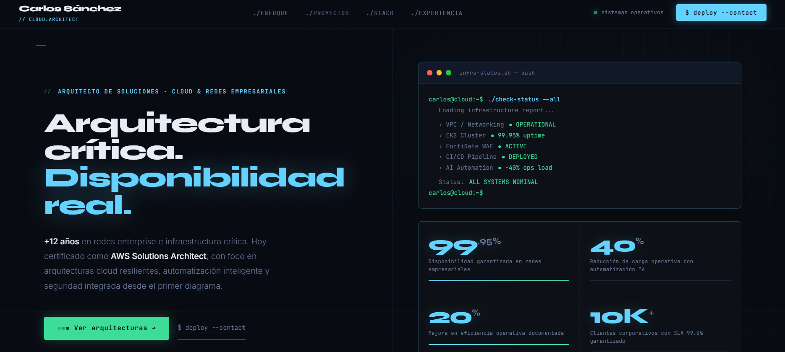
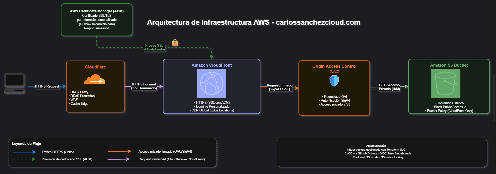

# carlossanchezcloud-portfolio-iac


---

## 🌐 Live

**[carlossanchezcloud.com](https://carlossanchezcloud.com)**



---

## 📋 Descripción

Diseñé y desplegué una plataforma web 100% automatizada sobre AWS utilizando Terraform modular, con autenticación OIDC sin credenciales estáticas, arquitectura segura basada en Origin Access Control (OAC) y pipelines Zero-Secrets en GitHub Actions.

La infraestructura sigue principios de AWS Well-Architected, es completamente reproducible en un solo comando y opera con un costo optimizado inferior a $0.20 USD/mes bajo enfoque FinOps.

---

## 🏗️ Arquitectura



---

## ✨ Decisiones Técnicas Clave

- **OAC sobre OAI** - Origin Access Control reemplaza al OAI deprecado. Mayor seguridad con soporte SSE-KMS y firma SigV4
- **S3 Native Locking** - Terraform >= 1.10 elimina la dependencia de DynamoDB para el tfstate lock
- **OIDC Zero-Secrets** - GitHub Actions se autentica en AWS sin Access Keys permanentes. Token temporal por ejecución
- **Wildcard SSL en ACM** — Un solo certificado cubre el dominio raíz y cualquier subdominio futuro
- **DNS automatizado** - Registros CNAME gestionados via Cloudflare API desde Terraform
- **Security Headers** - HSTS, X-Frame-Options, Content-Type-Options aplicados en cada respuesta

---

## 📈 Impacto Arquitectónico

- 100% automatización end-to-end (infraestructura y despliegue de contenido)
- 0 credenciales estáticas mediante federación OIDC (Zero-Secrets)
- Infraestructura completamente reproducible con terraform apply
- Tiempo promedio de despliegue inferior a 3 minutos
- Superficie de ataque reducida mediante OAC y bucket privado sin acceso público
- Costo operativo optimizado bajo enfoque FinOps: < $0.20 USD/mes

---

## 💰 Costo Estimado

| Servicio | Costo/mes USD |
|---|---|
| S3 Storage + Requests | ~$0.01 |
| CloudFront | ~$0.17 |
| ACM Certificate | $0.00 |
| Cloudflare DNS | $0.00 |
| **Total** | **~$0.19 USD/mes** |

---

## 📁 Estructura del Proyecto
```
carlossanchezcloud-portfolio-iac/
├── .github/
│   └── workflows/
│       ├── infra-deploy.yml      # Pipeline Terraform plan + apply
│       └── content-deploy.yml    # Pipeline S3 sync + CF invalidation
├── docs/
│   ├── architecture/
│   │   ├── architecture.png      # Diagrama exportado
│   │   └── architecture.drawio   # Diagrama editable
│   ├── screenshots/
│   │   └── 01-website-live.png   # Sitio live en producción
│   └── decisions/
│       ├── ADR-001-oac-vs-oai.md
│       ├── ADR-002-s3-native-locking.md
│       └── ADR-003-cloudflare-dns.md
├── modules/
│   ├── s3/
│   │   ├── main.tf               # Bucket privado + versioning + lifecycle
│   │   ├── variables.tf
│   │   └── outputs.tf
│   ├── cloudfront/
│   │   ├── main.tf               # Distribución global + OAC + security headers
│   │   ├── variables.tf
│   │   └── outputs.tf
│   ├── acm/
│   │   ├── main.tf               # Certificado SSL + validación DNS
│   │   ├── variables.tf
│   │   └── outputs.tf
│   └── cloudflare_dns/
│       ├── main.tf               # Registros CNAME root y www
│       ├── variables.tf
│       └── outputs.tf
├── website/
│   ├── index.html                # Página principal
│   ├── style.css                 # Estilos
│   └── *.js                      # Scripts
├── backend.tf                    # S3 remote state + native locking
├── iam.tf                        # OIDC provider + rol GitHub Actions
├── main.tf                       # Orquestación de módulos
├── variables.tf                  # Variables globales
├── outputs.tf                    # Outputs de infraestructura
├── providers.tf                  # AWS + Cloudflare providers
├── terraform.tfvars              # Valores reales (en .gitignore)
├── terraform.tfvars.example      # Template público sin secretos
└── .gitignore                    # Protección de archivos sensibles
```

---

## 🚀 Quick Start

### Prerequisites

- Terraform >= 1.10
- AWS CLI configurado
- Cuenta Cloudflare con API Token
- Bucket S3 para tfstate creado manualmente

### Bootstrap
```bash
# 1. Crear bucket tfstate manualmente
aws s3api create-bucket \
  --bucket tu-proyecto-tfstate-prod \
  --region us-east-1

aws s3api put-bucket-versioning \
  --bucket tu-proyecto-tfstate-prod \
  --versioning-configuration Status=Enabled

# 2. Clonar el repositorio
git clone https://github.com/TU_USUARIO/carlossanchezcloud-portfolio-iac.git
cd carlossanchezcloud-portfolio-iac

# 3. Configurar variables
cp terraform.tfvars.example terraform.tfvars
# Edita terraform.tfvars con tus valores reales

# 4. Inicializar y desplegar
terraform init
terraform plan
terraform apply
```

---

## 🔄 CI/CD

Dos pipelines independientes en GitHub Actions:

**infra-deploy.yml** - Se ejecuta cuando hay cambios en archivos `.tf`
```
push a main → terraform init → validate → plan → apply
```

**content-deploy.yml** - Se ejecuta cuando hay cambios en `/website`
```
push a main → aws s3 sync → CloudFront invalidation
```

Autenticación via **OIDC** - sin Access Keys permanentes en GitHub Secrets.

---

## 📐 Architecture Decision Records

- [ADR-001 — OAC sobre OAI](docs/decisions/ADR-001-oac-vs-oai.md)
- [ADR-002 — S3 Native Locking sin DynamoDB](docs/decisions/ADR-002-s3-native-locking.md)
- [ADR-003 — Cloudflare DNS + ACM](docs/decisions/ADR-003-cloudflare-dns.md)

---

## 👤 Autor

**Carlos Sánchez**
AWS Certified Solutions Architect | Cloud & Network Architect
Arquitecturas Híbridas AWS & On-Prem | Reduzco costos y garantizo
continuidad operativa con IaC & CI/CD

- 🌐 [carlossanchezcloud.com](https://carlossanchezcloud.com)

---

## 📄 Licencia

MIT License - ver [LICENSE](LICENSE)